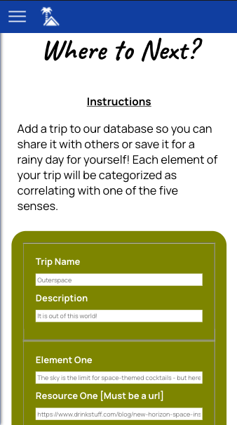

<h1>home holiday API<h1>

*Live DEMO*: https://home-holiday.now.sh/

## Description

This API supports home holiday, a virtual trip itinerary generator that inspires authentic connection among friends and family.  Users can choose from carefully created experiences that will immerse them in the spirit of their "destination" or create itineraries of their own.  Key user features include tracking trip completion status and giving feedback on trips by giving or taking away 'kudos'.

## Routes

/api/trips

* GET : returns an array of all trips (type: objects) in the database

* POST : insert a new trip into the database and returns the new trip (type: object) and its location

/api/trips/:trip_id

* GET : returns the trip (type: object) specified in the dynamic portion of the path

* DELETE : removes the trip specified in the dynamic portion of the path 

* PATCH : updates the record of the trip specified in the dynamic portion of the path; supports update of either 'is_taken' value OR 'kudos' value in a single request

/api/dashboard

* GET : returns the total number of trips in the database

/api/dashboard/taken

* GET : returns the total number of completed trips

## Screenshots

Navigation:

Dashboard Stats:

Trips List:

Add Trip Form:

## Technology

* Node.js
* Express
* JavaScript
* PostgreSQL
* Testing: Mocha / Chai / Supertest

## Scripts

Start the application `npm start`

Start nodemon for the application `npm run dev`

Run the tests `npm test`

